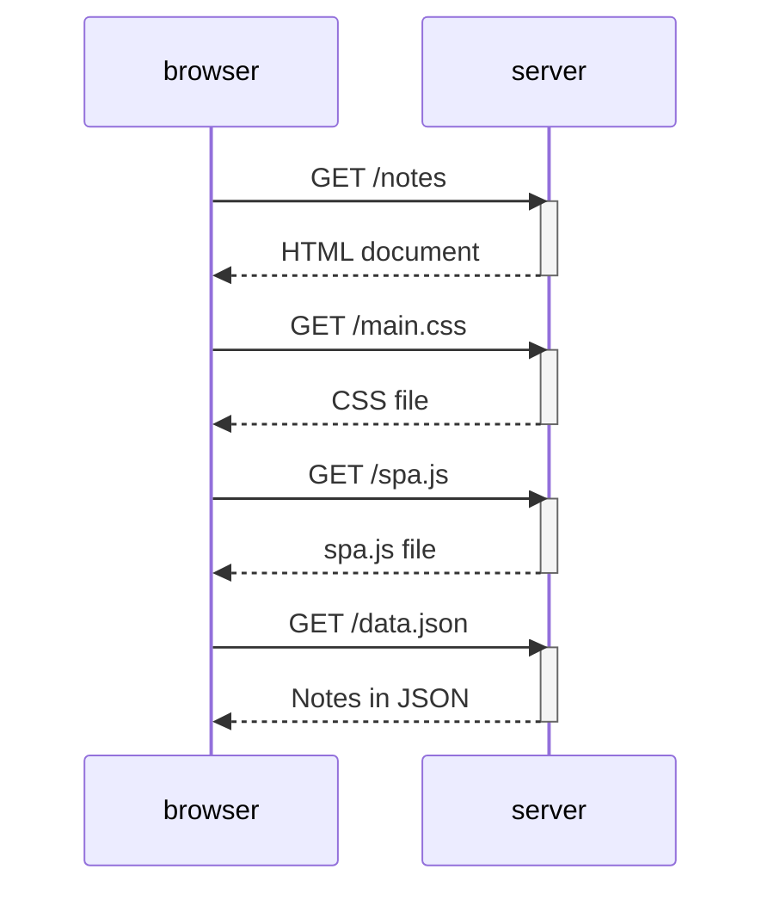

```mermaid
sequenceDiagram
    participant browser
    participant server

    browser->>server: GET /notes
    activate server
    server-->>browser: HTML document
    deactivate server
    browser->>server: GET /main.css
    activate server
    server-->>browser: CSS file
    deactivate server
    browser->>server: GET /spa.js
    activate server
    server-->>browser: spa.js file
    deactivate server
    browser->>server: GET /data.json
    activate server
    server-->>browser: Notes in JSON
    deactivate server
```