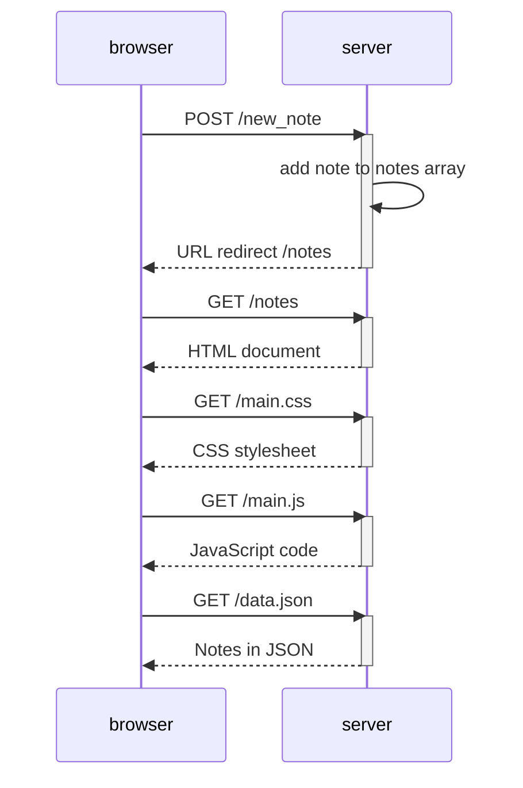

```mermaid
sequenceDiagram
    participant browser
    participant server

    browser->>server: POST /new_note
    activate server
    server->>server: add note to notes array
    server-->>browser: URL redirect /notes
    deactivate server
    browser->>server: GET /notes
    activate server
    server-->>browser: HTML document
    deactivate server
    browser->>server: GET /main.css
    activate server
    server-->>browser: CSS stylesheet
    deactivate server
    browser->>server: GET /main.js
    activate server
    server-->>browser: JavaScript code
    deactivate server
    browser->>server: GET /data.json
    activate server
    server-->>browser: Notes in JSON
    deactivate server
```